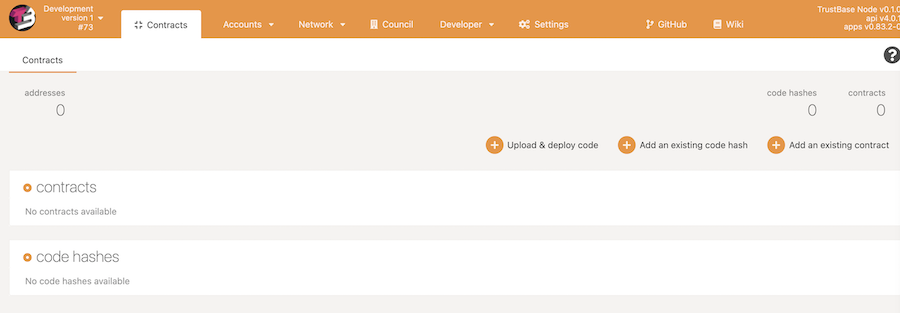
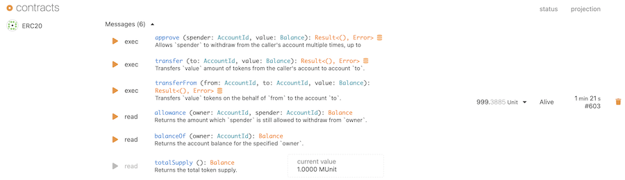
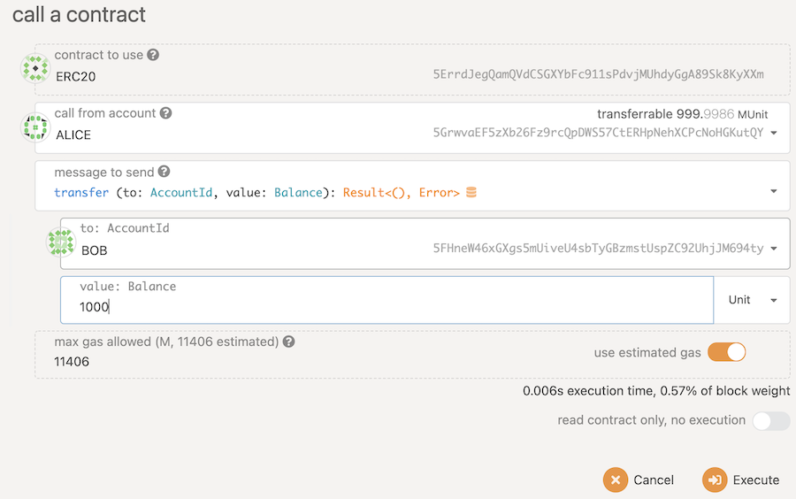

## ERC20 Contract

There is a library repo for ERC20 Contract

```
git clone https://github.com/TrustBase/trusted-contracts.git
```

ink! ERC20 contracts locates in ./trusted-contracts/contracts/erc20


## Building ERC20 Contract

Run the following command to compile your smart contract:

```
cd ./contracts/erc20
cargo +nightly contract build
```

This special command will turn your ink! project into a Wasm binary, a metadata file (which contains the contract's ABI) and a .contract file which bundles both. This .contract file can be used for deploying your contract to your chain. If all goes well, you should see a target folder which contains these files:

```
target
└── erc20.wasm
└── metadata.json
└── erc20.contract
```

## Pre-build contract

You can use the [pre-built erc20 download](https://github.com/TrustBase/trusted-contracts/releases/download/v0.1.0/erc20.contract) to deploy your contract.

## Deploying Your Contract

Now that we have generated the Wasm binary from our source code , we want to deploy this contract onto Trustbase chain.

Smart contract deployment on Trustbase chain is a little different than on traditional smart contract blockchains.


Whereas a completely new blob of smart contract source code is deployed each time you push a contract on other platforms, Trustbase chain opts to optimize this behavior. For example, the standard ERC20 token has been deployed to Ethereum thousands of times, sometimes only with changes to the initial configuration (through the Solidity constructor function). Each of these instances take up space on the blockchain equivalent to the contract source code size, even though no code was actually changed.

we will deploy the smart contract use the `Polkadot JS Apps`, Go to `Developer` -> `Contracts` page.
In the `Code` tab. If you have not yet deployed a contract onto your node, the Code tab will be the only one available.




+ Ensure the deployment account is set and it will have a sufficient balance for us to deploy, instantiate and test the contract
+ click the `Upload & deploy code` button, upload erc20.contract from build target directory.
+ Set the initialSupply to 1000000, endowment to 1000


Once configured, hit deploy button, sign and Submit the transaction. The transactions will take place and the contract code will be deployed.


## Call transfer method



Click the `exec` button of `transfer` method.

Specify the fields of the `transfer` dialog.

* Call from Account
* to Account
* Value

