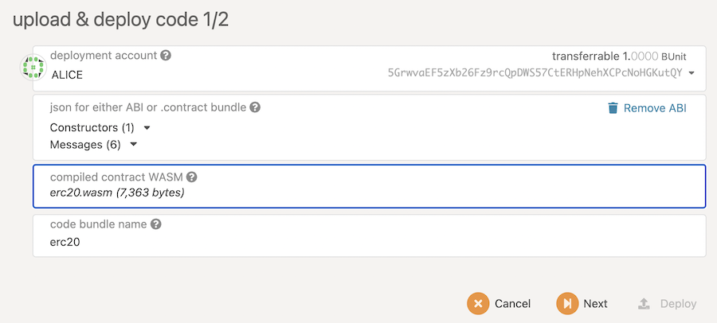

This section will show how to build erc20 contract with subscript on trustbase.


## Setup Envionment

This repository requires `yarn`. the [install](https://classic.yarnpkg.com/en/docs/install/) guide shows
how to install yarn pkg.

Clone the repo

```
git clone https://github.com/ascontract/subscript.git
cd ./subscript
```

install all dependencies

```
yarn install
```

## ERC20 contract with subscript


There is an erc20 example in `./examples/erc20`.
Run the following command to compile erc20 contract with subscript.

**Install dependencies:**

```
cd ./examples/erc20
yarn install
```

**Build Wasm target**

```
yarn build
```

After build, you can find the target wasm file in `./build/erc20.wasm` and metadata in `./build/metadata.json`.

## Deploy erc20 contract on trustbase

The section show how to use the trustbase local chain to deploy erc20 contract.
The trustbase client can be install from [pre-build download](https://docs.trustednodes.net/docs/install/#pre-build-binary).

### run trustbase dev chain

Ddd `--dev` option to run client in development mode

```
./trustbase --dev --tmp
```

### deploy ERC20 contract use Polkajs app

Open your chrome browser, navigate to https://polkadot.js.org/apps/#/settings?rpc=ws://127.0.0.1:9945

The link provided above includes the rpc URL parameter, which instructs the Apps UI to connect to the URL that was provided as your local node.

Go to Developer -> Contracts page. In the Code tab. If you have not yet deployed a contract onto your node, the Code tab will be the only one available.



* click the Upload & deploy code button
* select the json field with `./build/metadata.json`
* select the wasm field with `./build/erc20.wasm`
* click `next`, Set the initialSupply to 1000000, endowment to 1000

Once configured, hit `deploy` button, then sign and submit the transaction. The transactions will take place and the contract code will be deployed.